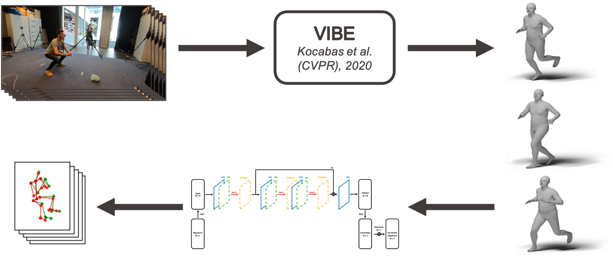
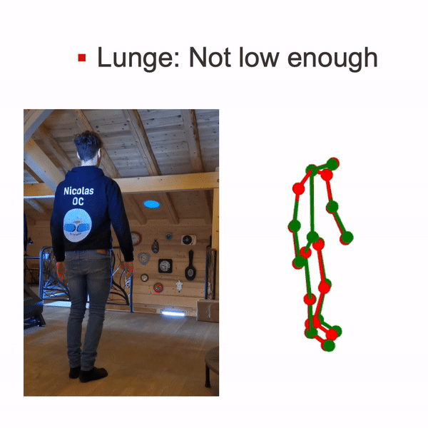

# 3D Pose Based Motion Correction for Physical Exercises

_Master project in Life Sciences Engineering, CVLAB (EPFL), 2021_  

## Summary

**With the rise of self-management for treatment of musculoskeletal disorders and especially during these times of pandemic, people tend to exercise alone and without supervision. Recent progresses in fields of pose estimation, action recognition and motion prediction allow us to analyze movements in details and thus identify potential mistakes done while exercising. In this work, we prepare a dataset containing videos, 2D and 3D poses of correct and incorrect executions of different movements that are SQUATS, lunges, planks and pick- ups and labels identifying the mistake in each practice of that exercise. This dataset is used to demonstrate our motion correction model, designed using a graph convolutional network architecture and trained with a differentiable dynamic time warping loss. As a result we are able to correct movement mistakes in 3D pose sequences and output the corrected motion. This model is integrated in a pipeline containing a state-of-the-art 3D human pose estimator to go from raw video images to a sequence of corrected 3D poses. Evaluation of this model is done using an action recognition model trained on the same dataset to recognize whether the sequence is correct or has a particular type of mistake. Results show that our model is successful in correcting incorrect sequences, as most of the time the resulting motions are classified as correct.**

## Dataset

**Examples of acquired images for each action, subject and camera and 3D ground truth poses computation.**
<p float="center">
  
  
</p>

## Correction model

### Network architecture
<p float="center">
  
</p>

### Results
<p float="center">
  
  
</p>

Moving version of these corrections can be observed in:

- images/lunge_plank.html  
- images/squat.html

## Classification model

### Network architecture
<p float="center">
  
</p>

### Results

**Action recognition model performance**
<p float="center">
  
</p>

**Motion correction model evaluation**
<p float="center">
  
</p>

## Pipeline

<p float="center">
  
</p>

### Results

<p float="center">
  
  
  
  
</p>

## Getting Started
This has been implemented and tested on Ubuntu 18.04 with python >= 3.7. It supports both GPU and CPU inference.
If you don't have a suitable device, try running our Colab demo. 

Clone the repo:
```bash
git clone https://github.com/huguesvinzant/Motion-Correction.git
```

Install the requirements using `virtualenv` or `conda`:
```bash
# pip
source VIBE/scripts/install_pip.sh

# conda
source VIBE/scripts/install_conda.sh
```

Download VIBE trained model and SMPL model parameters. To do this you can just run:
```bash
source scripts/prepare_data.sh
```

Then, running the demo is as simple as:
```bash
python main_vibe_test.py
```
